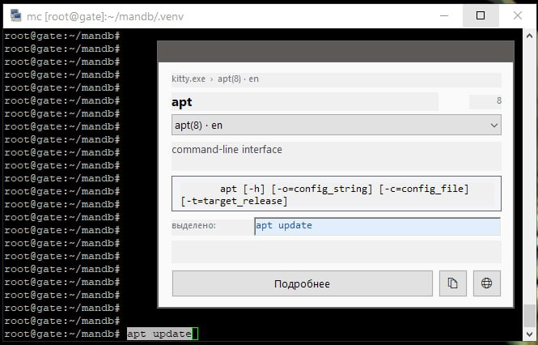
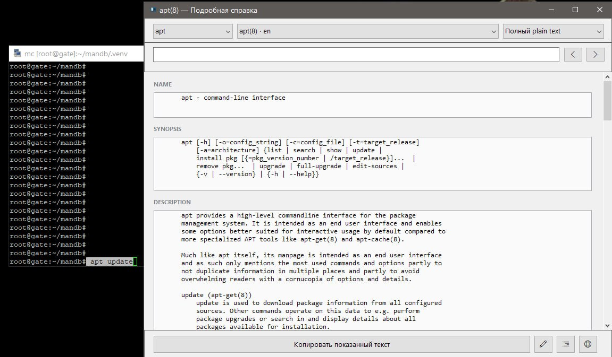

# ManHelper

ManHelper is an offline Windows companion for PuTTY and KiTTY. It finds the
Linux command copied from a terminal and shows the corresponding manual page
from a read-only SQLite database. The same repository contains the Linux
database builder and a Windows database validator.

[Русская версия](README_RU.md)

## Components

- [`windows/manhelper`](windows/manhelper) — the Windows tray application;
- [`linux/manbase-builder`](linux/manbase-builder) — the Linux CLI that builds
  the portable man-page database;
- [`windows/validator`](windows/validator) — Windows CLI and GUI database
  validators;
- [`database_contract.md`](database_contract.md) — the SQLite format contract;
- [`release-assets`](release-assets) — files prepared for publication through
  GitHub Releases.

## Documentation

- [ManHelper installation and usage (English)](docs/windows/README_EN.md)
- [Установка и использование ManHelper (русский)](docs/windows/README_RU.md)
- [ManBase Builder installation and usage (English)](docs/linux/README_EN.md)
- [Установка и использование ManBase Builder (русский)](docs/linux/README_RU.md)

## How the parts work together

ManBase Builder scans installed man pages on Linux and creates one portable
SQLite database. ManHelper opens that database read-only on Windows and uses
exact-name, alias and FTS5 searches to display the matching documentation.
ManBase Validator can check a database on Windows before it is distributed or
used by ManHelper.

ManHelper does not execute copied commands, does not simulate `Ctrl+C`, and
does not modify the system man-page database.

## Releases

The prepared Windows ZIP is kept in `release-assets` for upload as a GitHub
Release asset. Its uncompressed database is larger than GitHub's regular
100 MiB per-file Git limit and therefore must not be committed as an ordinary
repository file.

## License

Non-commercial use only. See [LICENSE](LICENSE).

Copyright (C) CheshirCa 2026 — https://t.me/cheshircanest
